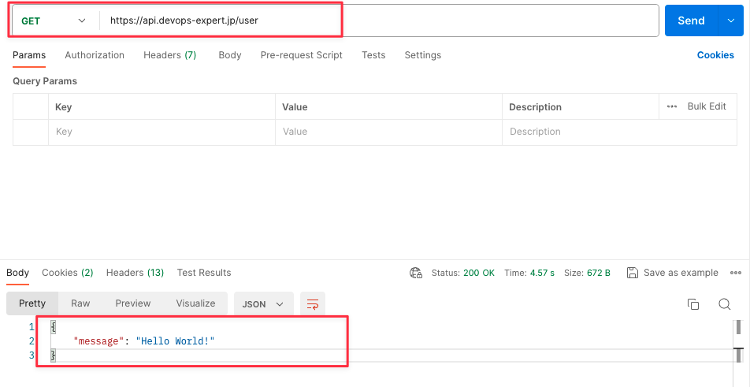

# Laravel アプリケーション App Service でマルチドメインに対応する方法

# はじめに

本ドキュメントでは、Laravel アプリケーションを App Service でマルチドメインに対応する方法を説明します。
ソースコードと合わせて確認ください。

想定環境としては最もシンプルなコードデプロイで検証しています。(PHP 8.2 Linux Laravel 作成時点最新 10.10 環境)

目指す環境としては同一アプリケーション内で複数のドメインを扱えるようにすることです。

設定前の環境の設定
web: example.com/
api: example.com/api

設定後の環境の設定
web: example.com/
api: api.example.com/

とすることで api 用のサブドメインを割り当て、api プレフィックスを api ルートから削除します。

なお検証環境では私のドメイン`devops-expert.jp`を使い
web: admin.devops-expert.jp/
api: api.devops-expert.jp/
と独自で取得した SSL 証明書で検証しています。

ローカル環境では`localhost`と`127.0.0.1`の２つのホスト名を使い分ける形で検証しています。

# 事前準備

-   ドメインを取得する
-   SSL 証明書を取得する

上記については既にあるもののとして解説します。

# ソースコードの変更

ソースコードについては最低限下記の点の変更を行います。

-   app/Http/Middleware/TrustProxies.php
-   app/Providers/RouteServiceProvider.php
-   config/app.php
-   route/api.php

## app/Http/Middleware/TrustProxies.php

PHP8.2 の Linux 環境では nginx がロードバランサーとして使われるため、それを信頼するための設定をしてください。
なおこの設定をしないと SSL 証明書を入れているのにも関わらず、https でアクセスした際に「安全ではありません」と表示されてしまいます。

Before

```php
    protected $proxies;
```

After

```php
    protected $proxies = '*';
```

なお、より詳細に指定する場合はプロキシの IP アドレスを指定できますが、App Service では不特定多数の IP アドレスが割り当てられるため、`*` で全ての IP アドレスを信頼するように設定します。

## app/Providers/RouteServiceProvider.php

こちらは要件により異なりますが、下記の点を調整しました。

-   Laravel では api アクセスに関してはデフォルトでは api プレフィックスがつきますが、今回は api サブドメインを使うため、api プレフィックスを削除します。

ルーティングによっては残しておくことも考えられます。

Before

```php
$this->routes(function () {
        Route::middleware('api')
            ->prefix('api')
            ->group(base_path('routes/api.php'));

        Route::middleware('web')
            ->group(base_path('routes/web.php'));
    });
```

After

```php
$this->routes(function () {
        Route::middleware('api')
            ->group(base_path('routes/api.php'));

        Route::middleware('web')
            ->group(base_path('routes/web.php'));
        });
```

api プレフィックスを削除することで、api サブドメインを使う準備を整えます。

## config/app.php

こちらも要件により異なりますが、ドメインによってルーティングを制御するための環境変数を設定します。

下記を config/app.php の配列の最後に追加します。

```php
    /*
    |--------------------------------------------------------------------------
    | Domains
    |--------------------------------------------------------------------------
    |
    | Domains needed in order to change route according to the domain
    | Kind: admin, api
    | admin is for admin panel. api is for api calls
    */

    'admin_domain' => env('ADMIN_DOMAIN', '127.0.0.1'),
    'api_domain' => env('API_DOMAIN', 'localhost'),

```

ここでは`admin_domain`と`api_domain`の２つのドメインを設定しています。

この値は環境変数によって制御します。

ローカル環境では管理者用のドメインとして`127.0.0.1`
api ドメインとして`localhost`を使っていますが、本番環境ではそれぞれのドメインを設定します。

また、`admin_domain`,`api_domain`と言う名前も任意ですので要件に合わせて調整してください。

この後ルーティングの設定時に使います。

## route/api.php

先ほど設定したドメインに応じてルーティングを制御します。

Before

```php
Route::middleware('auth:sanctum')->get('/user', function (Request $request) {
    return $request->user();
```

After

```php
Route::domain(config('app.api_domain'))->group(function () {
    Log::info('api_url',['api_url' => url()->current()]);
    // api routes inside here
    Route::get('/user', function (Request $request) {
        return response()->json([
            'message' => 'Hello World!',
        ], 200);
    });
});

Route::prefix('api')->domain(config('app.admin_domain'))->group(function () {
    Log::info('admin_api', [ 'api_url' => url()->current()] );
    // Migrate routes into this if you want to maintain compatibility.
    Route::get('/user', function (Request $request) {
        return response()->json([
            'message' => 'Hello World!',
        ], 200);
    });
});
```

ここでは`api_domain`と`admin_domain`の２つのドメインによってルートを変動させています。

api_domain では先ほど削除された api プレフィックスをベースにして`/user`にルートさせています。
つまり`api.example.com/user`にアクセスした場合にルートします。

admin_domain では`admin.example.com/api/user`にアクセスした場合にルートします。
そうすることで今までのルートを維持しつつ、api サブドメインを使うことができます。

```php
 // Migrate routes into this if you want to maintain compatibility.
    Route::get('/user', function (Request $request) {
        return response()->json([
            'message' => 'Hello World!',
        ], 200);
    });
```

こちらの部分に今まで使っていた API のルートを移行させることで、今までのルートを維持しつつ、api サブドメインを使うことができます。

なお、こちらでは単純に記載するために認証は排除していますので、本番環境では適切な認証を設定してください。
また、App Service 内でルーティングがうまくいかないことがあったためログを出力しています。

```php
Log::info('api_url',['api_url' => url()->current()]);
```

この例では API アクセスがあった場合に Info レベルでどの URL でアクセスされたか検証していますが、こちらの設定は任意です。

# ローカルでの環境設定と検証

ローカル環境では`localhost`と`127.0.0.1`の２つのホスト名を使い分ける形で検証ができます。

`.env`に下記のように設定することで検証してください。

```
ADMIN_DOMAIN=127.0.0.1
API_DOMAIN=localhost
```

`127.0.0.1`でアクセスした場合は`/api/user`にアクセスしてレスポンスを確認できますが、`localhost`でアクセスした場合は`/user`だけでレスポンスを確認できるようになります。

これは上記のドメインによって変更したルーティングの成果です。

# nginx の設定(補足)

App ServiceLinux php8.0 以降では nginx がプロキシとして使われるため、nginx の設定を変更する必要があります。
そのままデプロイすると index.php へのアクセスができず、404 エラーが発生します。

ここでは nginx の設定を Laravel 用にカスタマイズする方法を解説します。

もし設定してある場合は次に進んでください。
nginx の設定する方法についてはこちらの記事を参考にしてください。
[Configure Nginx for PHP 8 Linux Azure App Service](https://techcommunity.microsoft.com/t5/apps-on-azure-blog/configure-nginx-for-php-8-linux-azure-app-service/ba-p/3069373)

まず App service においては`/home`以下のディレクトリは永続化されますが、それ以外のディレクトリは再起動時やメンテナンスのタイミングで削除されます。

App service では設定ファイルは
`/etc/nginx/sites-available/default.conf`として保存されているため、こちらを`/home`以下にコピーして永続化します。

```bash
cp /etc/nginx/sites-enabled/default /home/default
```

デフォルトの nginx 設定ファイルは下記のようになっています。

```
server {
    #proxy_cache cache;
        #proxy_cache_valid 200 1s;
    listen 8080;
    listen [::]:8080;
    root /home/site/wwwroot;
    index  index.php index.html index.htm;
    server_name  example.com www.example.com;
    port_in_redirect off;

    location / {
        index  index.php index.html index.htm hostingstart.html;
    }

    # redirect server error pages to the static page /50x.html
    #
    error_page   500 502 503 504  /50x.html;
    location = /50x.html {
        root   /html/;
    }

    # Disable .git directory
    location ~ /\.git {
        deny all;
        access_log off;
        log_not_found off;
    }

    # Add locations of phpmyadmin here.
    location ~* [^/]\.php(/|$) {
        fastcgi_split_path_info ^(.+?\.[Pp][Hh][Pp])(|/.*)$;
        fastcgi_pass 127.0.0.1:9000;
        include fastcgi_params;
        fastcgi_param HTTP_PROXY "";
        fastcgi_param SCRIPT_FILENAME $document_root$fastcgi_script_name;
        fastcgi_param PATH_INFO $fastcgi_path_info;
        fastcgi_param QUERY_STRING $query_string;
        fastcgi_intercept_errors on;
        fastcgi_connect_timeout         300;
        fastcgi_send_timeout           3600;
        fastcgi_read_timeout           3600;
        fastcgi_buffer_size 128k;
        fastcgi_buffers 4 256k;
        fastcgi_busy_buffers_size 256k;
        fastcgi_temp_file_write_size 256k;
    }
}
```

特に重要なのは

`root /home/site/wwwroot;`
の部分であり、これが public フォルダを読み込まず
アプリケーションコードのルートの php ファイルを読み込んでしまうのが原因です。

ちなみにこの default のファイルは
`/etc/nginx/nginx.conf`によって読み込まれています。

参考までに乗せます。

```
user www-data;
worker_processes auto;
pid /run/nginx.pid;
include /etc/nginx/modules-enabled/*.conf;

events {
        worker_connections 10068;
        multi_accept on;
}

http {

        ##
        # Basic Settings
        ##

        sendfile on;
        tcp_nopush on;
        types_hash_max_size 2048;
        # server_tokens off;

        # server_names_hash_bucket_size 64;
        # server_name_in_redirect off;

        include /etc/nginx/mime.types;
        default_type application/octet-stream;

        ##
        # SSL Settings
        ##

        ssl_protocols TLSv1 TLSv1.1 TLSv1.2 TLSv1.3; # Dropping SSLv3, ref: POODLE
        ssl_prefer_server_ciphers on;

        ##
        # Logging Settings
        ##

        access_log off;
        error_log /dev/stderr;

        ##
        # Gzip Settings
        ##

        gzip on;

        # gzip_vary on;
        # gzip_proxied any;
        # gzip_comp_level 6;
        # gzip_buffers 16 8k;
        # gzip_http_version 1.1;
        # gzip_types text/plain text/css application/json application/javascript text/xml application/xml application/xml+rss text/javascript;

        ##
        # Virtual Host Configs
        ##

        include /etc/nginx/conf.d/*.conf;
        include /etc/nginx/sites-enabled/*;
}


#mail {
#       # See sample authentication script at:
#       # http://wiki.nginx.org/ImapAuthenticateWithApachePhpScript
#
#       # auth_http localhost/auth.php;
#       # pop3_capabilities "TOP" "USER";
#       # imap_capabilities "IMAP4rev1" "UIDPLUS";
#
#       server {
#               listen     localhost:110;
#               protocol   pop3;
#               proxy      on;
#       }
#
#       server {
#               listen     localhost:143;
#               protocol   imap;
#               proxy      on;
#       }
#}
```

`include /etc/nginx/sites-enabled/*;`によって`/etc/nginx/sites-enabled/default`が読み込まれています。

本題に戻りますが、Home 以下にコピーした nginx を下記ように編集します。

```
server {
    #proxy_cache cache;
        #proxy_cache_valid 200 1s;
    listen 8080;
    listen [::]:8080;
    root /home/site/wwwroot/public;
    add_header X-Frame-Options "SAMEORIGIN";
    add_header X-XSS-Protection "1; mode=block";
    add_header X-Content-Type-Options "nosniff";
    index  index.php index.html index.htm;
    server_name api.devops-expert.jp admin.devops-expert.jp laravel-muti-domain-app-dev.azurewebsites.net;
    port_in_redirect off;

    location / {
        try_files $uri $uri/ /index.php?$query_string;
    }

    # Disable .git directory
    location ~ /\.git {
        deny all;
        access_log off;
        log_not_found off;
    }

    # 動的ファイルの時の処理
    location ~ \.php$ {
    try_files $uri =404;
    fastcgi_split_path_info ^(.+\.php)(/.+)$;
    fastcgi_pass 127.0.0.1:9000;
    fastcgi_index index.php;
    include fastcgi_params;
    fastcgi_param SCRIPT_FILENAME $document_root$fastcgi_script_name;
    fastcgi_param PATH_INFO $fastcgi_path_info;
  }
}
```

ここでも重要なのは
`root /home/site/wwwroot/public;`
の部分で、こちらで Laravel の public フォルダを読み込むようになっています。これが App Service で Laravel を動かすためには重要です。

server_name では今回は３つのドメインを設定しています。
`api.devops-expert.jp admin.devops-expert.jp laravel-muti-domain-app-dev.azurewebsites.net`
これは新しく設定するドメインと appservice ドメインを設定しましたが、実際には nginx では server_name に設定されたドメインに一致しない場合、最初の server ブロックが適用されるため、動作はします。

また
`*.devops-expert.jp`のようなワイルドカードドメインを設定することもできますのでこの辺りは公式 nginx の参照してください。  
[nginx Beginner’s Guide](https://nginx.org/en/docs/beginners_guide.html)

内部的には nginx はポート`8080`で受けたリクエストを
fastcgi_pass で設定された`9000`ポートに転送しています。

カスタマイズした nginx の設定を反映させるためには
スタートアッププログラムを使って nginx を再起動する必要があります。

`/home/default`
のファイルを元々コピーされていた`/etc/nginx/sites-enabled/default`に上書きし nginx を再起動します。

`cp /home/default /etc/nginx/sites-enabled/default; service nginx restart`

こちらをスタートアップコマンドに貼り付けることで、nginx の設定を反映させることができます。


## 参考

またよくある Laravel の nginx 設定や解説については下記のようなサイトも参考になります。

[nginx.conf の歩き方。Nginx で Laravel を動かすための設定を読み解く
](https://www.cyberowl.co.jp/blog/technology/1230)  
[Laravel 公式サイトに記載してある Nginx の conf を超絶丁寧に読み解いていく](https://qiita.com/michida/items/d5c0fc5096d80ce49229)

# ドメインの設定


App Service で追加でカスタムドメインを追加します。
2 つとも SSL/TLS 証明書を設定しセキュリティ保護されていることを確認してください。

なお、ドメイン追加時には App Service の CNAME レコードの設定とドメイン検証用の TXT レコードの設定が必要ですが、ネットワーク設定にも応じて異なりますので、こちらは各自設定が必要です。

# 環境変数の設定

最後に環境変数を設定します。

先ほど`config/app.php`に設定した`admin_domain`と`api_domain`を設定します。

admin_domain には管理者用のドメインを設定します。
api_domain には api 用のドメインを設定します。

このドメインの名前も、用途も要件に合わせて選択できます。


また、`APP_URL`も設定しておきます。


Laravel10 における標準実装は APP_URL に設定されたドメインを信頼されたホストとみなすため、こちらを設定しておかないと信頼されたドメインとして扱われません。

ここでは

`https://devops-expert.jp`  
`https://example.com`

このようにサブドメインの元になるドメインを設定します。

なお、その実装自体は Laravel の
`app/Http/Middleware/TrustHosts.php`
に記載されていますので、こちらのコードを修正するような対処も可能です。

`app/Http/Middleware/TrustHosts.php`

```php
<?php

namespace App\Http\Middleware;

use Illuminate\Http\Middleware\TrustHosts as Middleware;

class TrustHosts extends Middleware
{
    /**
     * Get the host patterns that should be trusted.
     *
     * @return array<int, string|null>
     */
    public function hosts(): array
    {
        return [
            $this->allSubdomainsOfApplicationUrl(),
        ];
    }
}
```

`$this->allSubdomainsOfApplicationUrl()`
こちらの部分で APP_URL に設定されたドメインとそのドメインを信頼されたホストとして扱うようになっています。

# ソースコードデプロイ

ソースコードをデプロイします。
今回の検証では Visual Studio Code の Azure 拡張機能を使ってデプロイしています。


# 動作検証

ここまでで設定が完了しましたので、動作検証を行います。

_`Admin(Web)ホーム画面`_


_`Admin(Web) APIレスポンス(互換性維持の証明)`_


_`apiサブドメインでのAPIレスポンス`_



以上で確認ができました。

# デバック

API のルーティングがうまくいかない場合は

`php artisan route:list`でルーティングの一覧を確認することができます。

また、そこでルーティングに設定されている場合は正しく url がアプリ上解釈されていない可能性があるため

`url()->current()`などを使ってアプリケーションで解釈されているかを確認しましょう。

また nginx 側のエラーの場合は App Service 内でログを確認することもできますので下記を確認してみてください。

`/dev/stderr`

# まとめ

この Doc では App Service で同一アプリケーション内で複数のドメインを設定する方法を解説しました。

-   ルーティングの設定と環境設定を読み込むコードの変更
-   nginx の設定
-   ドメインの設定
-   信頼されたホストやプロキシーの設定

上記を確認して設定してみてください。
